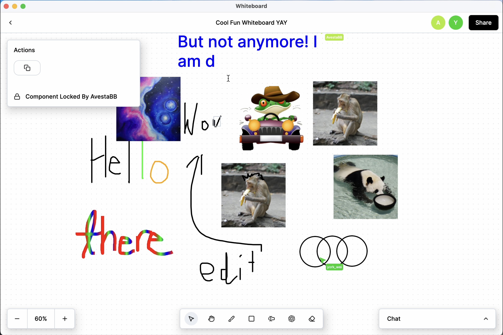

<!-- PROJECT SHIELDS -->
<!--
*** I'm using markdown "reference style" links for readability.
*** Reference links are enclosed in brackets [ ] instead of parentheses ( ).
*** See the bottom of this document for the declaration of the reference variables
*** for contributors-url, forks-url, etc. This is an optional, concise syntax you may use.
*** https://www.markdownguide.org/basic-syntax/#reference-style-links
-->

<!-- PROJECT LOGO -->
 

  

<h3 align="center">Whiteboard</h3>

<!-- TABLE OF CONTENTS -->

  
Table of Contents

  <ol>
    <li>
      <a href="#about-the-project">About The Project</a>
      <ul>
        <li><a href="#built-with">Built With</a></li>
      </ul>
    </li>
    <li>
      <a href="#getting-started">Getting Started</a>
    </li>
    <li><a href="#releases">Releases</a></li>
    <li><a href="#usage">Usage</a></li>
    <li><a href="#license">License</a></li>
    <li><a href="#contact">Contact</a></li>
    <li><a href="#acknowledgments">Acknowledgments</a></li>
  </ol>

<!-- ABOUT THE PROJECT -->
## About The Project

![Product Name Screen Shot][product-screenshot]

Whiteboard is a collaborative app that allows you to instantly collaborate with your friends, family, or coworkers to brainstorm and share ideas. Other than the standard features you'd expect, our digital whiteboard includes the following distinguishing features:
- Whiteboard Sharing
- Whiteboard Persistence
- AI Image Generation
- Chat
- Emoji Reactions/Pings
- Dark Mode
- Component Locking

(<a href="#readme-top">back to top</a>)

### Built With

* Compose for Desktop (UI library)
* Ktor Client Core + Ktor Client OkHttp (HTTP Networking)
* Krossbow (Kotlin STOMP client)
* Mockito (Mocking for tests)
* Kamel Image (Async image fetching from URL)
* Spring Boot
* Spring Web (HTTP)
* Spring WebSocket (STOMP server implementation comes included)
* Spring Data Jpa
* Spring Security
* Spring Test
* xerial:sqlite-jdbc (database driver so we can connect to SQLite DB)
* auth0's java-jwt (allows us to create JWTs)
* Gwenn's SQLite Dialect (Spring Data/Hibernate/JPA interop with SQLite)

(<a href="#readme-top">back to top</a>)

<!-- GETTING STARTED -->
## Getting Started

Download the installer corresponding to your system and use it to install Whiteboard
* MacOS ([.dmg](releases/1.3.0%20(FINAL%20VERSION)/Whiteboard-1.3.0.dmg))
* Windows ([.msi](releases/1.3.0%20(FINAL%20VERSION)/Whiteboard-1.3.0.msi))
* Linux ([.deb](releases/1.3.0%20(FINAL%20VERSION)/Whiteboard-1.3.0.deb))

(<a href="#readme-top">back to top</a>)

<!-- USAGE EXAMPLES -->
## Usage

Below is a demonstration of the following features:

- Creating and Sharing a Whiteboard

- Drawing with Path, Shapes, Text, Editing Attributes, and Resizing/Moving Elements

- AI Image Generation

- Zooming, Panning, Cutting, Copying, and Pasting

- Component Locking (What Others Will See when an Image is Locked)

- Chat

- Pings

- Teleporting to Another User's Cursor

- Dark mode

Features that aren't demonstrated are listed below:
- Shortcuts
  - Quit `CMD/Control Q`
  - Hide `CMD/Control H`
  - Dark Mode `CMD/CONTROL M`
  - Zoom In `CMD/Control +`
  - Zoom Out `CMD/Control -`
  - Cut `CMD/Control X`
  - Copy `CMD/Control C`
  - Paste `CMD/Control V`
  - Delete `Backspace`
  - Select `V`
  - Pan `D`
  - Pen `P`
  - Square `U`
  - Circle `C`
  - Text `T`
  - Eraser `X`
- Database Persistence

Troubleshooting:
- Switching to localhost: For development purposes, users switch to a backend service hosted on localhost via the menu bar settings.
- Valid Usernames: Must be 8-20 characters long, no _ or . at the beginning or end, no __ or \_. or ._ or .. inside. We allow letters, numbers, underscores, and periods.
- Running two instances of the application on the same computer: We use Java's Persistence API to store user credentials. When there are two instances of the app running at the same time, one instance's credentials get overwritten. This causes undefined behaviour with our features. To test multiplayer, please use two or more computers.

(<a href="#readme-top">back to top</a>)

## Releases
Note for Earlier Versions:

The earlier versions of our app depend on the server to login. However, the server APIs have changed and so has the host. Henceforth you will be unable to login to earlier versions and use the app. In some versions you are able to login, however, the WebSocket APIs are different and as a result the functionality does not work.

version 1.0.0: released 02/17/2023 (Sprint 1)
* release-notes ([.txt](releases/1.0.0/v1.0.0-release-notes.txt))
* MacOS ([.dmg](releases/1.0.0/Whiteboard-1.0.0.dmg))
* Windows ([.msi](releases/1.0.0/Whiteboard-1.0.0.msi))
* Linux ([.deb](releases/1.0.0/Whiteboard-1.0.0.deb))

version 1.1.0: released 03/10/2023 (Sprint 2)
* release-notes ([.txt](releases/1.1.0/v1.1.0-release-notes.txt))
* MacOS ([.dmg](releases/1.1.0/Whiteboard-1.1.0.dmg))
* Windows ([.msi](releases/1.1.0/Whiteboard-1.1.0.msi)
* Linux ([.deb](releases/1.1.0/whiteboard_1.1.0-1_amd64.deb)

version 1.2.0: released 03/24/2023 (Sprint 3)
* release-notes ([.txt](releases/1.2.0/v1.2.0-release-notes.txt))
* MacOS ([.dmg](releases/1.2.0/Whiteboard-1.2.0.dmg))
* Windows ([.msi](releases/1.2.0/Whiteboard-1.2.0.msi))
* Linux ([.deb](releases/1.2.0/whiteboard_1.2.0_amd64.deb))

version 1.3.0: released 04/10/2023 (Sprint 4)
* release-notes ([.txt](releases/1.3.0%20(FINAL%20VERSION)/v1.3.0-release-notes.txt))
* MacOS ([.dmg](releases/1.3.0%20(FINAL%20VERSION)/Whiteboard-1.3.0.dmg))
* Windows ([.msi](releases/1.3.0%20(FINAL%20VERSION)/Whiteboard-1.3.0.msi))
* Linux ([.deb](releases/1.3.0%20(FINAL%20VERSION)/Whiteboard-1.3.0.deb))

(<a href="#readme-top">back to top</a>)

<!-- LICENSE -->
## License

Distributed under the MIT License. See `LICENSE` for more information.

(<a href="#readme-top">back to top</a>)

<!-- TEAM MEMBERS -->
## Contact
- Avesta Barzegar: a3barzeg@uwaterloo.ca,
- York Wei: y269wei@uwaterloo.ca
- Mikail Rahman: am5rahma@uwaterloo.ca,
- Edward Wang: e97wang@uwaterloo.ca

(<a href="#readme-top">back to top</a>)

<!-- ACKNOWLEDGMENTS -->
## Acknowledgments

* Jeff Avery
* Caroline Kierstead
* Xiaoyan Xu
* Mattie Nejati
* Shahpar Khan
* Wen Cui
* Xueguang Ma

(<a href="#readme-top">back to top</a>)

<!-- MARKDOWN LINKS & IMAGES -->
<!-- https://www.markdownguide.org/basic-syntax/#reference-style-links -->
[contributors-shield]: https://img.shields.io/github/contributors/github_username/repo_name.svg?style=for-the-badge
[contributors-url]: https://github.com/github_username/repo_name/graphs/contributors
[forks-shield]: https://img.shields.io/github/forks/github_username/repo_name.svg?style=for-the-badge
[forks-url]: https://github.com/github_username/repo_name/network/members
[stars-shield]: https://img.shields.io/github/stars/github_username/repo_name.svg?style=for-the-badge
[stars-url]: https://github.com/github_username/repo_name/stargazers
[issues-shield]: https://img.shields.io/github/issues/github_username/repo_name.svg?style=for-the-badge
[issues-url]: https://github.com/github_username/repo_name/issues
[license-shield]: https://img.shields.io/github/license/github_username/repo_name.svg?style=for-the-badge
[license-url]: https://github.com/github_username/repo_name/blob/master/LICENSE.txt
[linkedin-shield]: https://img.shields.io/badge/-LinkedIn-black.svg?style=for-the-badge&logo=linkedin&colorB=555
[linkedin-url]: https://linkedin.com/in/linkedin_username
[product-screenshot]: project_management/readme_resources/intro.gif
[ai-gif]: project_management/readme_resources/aigenimage.gif
[copypaste-gif]: project_management/readme_resources/copypaste.gif
[Next.js]: https://img.shields.io/badge/next.js-000000?style=for-the-badge&logo=nextdotjs&logoColor=white
[Next-url]: https://nextjs.org/
[React.js]: https://img.shields.io/badge/React-20232A?style=for-the-badge&logo=react&logoColor=61DAFB
[React-url]: https://reactjs.org/
[Vue.js]: https://img.shields.io/badge/Vue.js-35495E?style=for-the-badge&logo=vuedotjs&logoColor=4FC08D
[Vue-url]: https://vuejs.org/
[Angular.io]: https://img.shields.io/badge/Angular-DD0031?style=for-the-badge&logo=angular&logoColor=white
[Angular-url]: https://angular.io/
[Svelte.dev]: https://img.shields.io/badge/Svelte-4A4A55?style=for-the-badge&logo=svelte&logoColor=FF3E00
[Svelte-url]: https://svelte.dev/
[Laravel.com]: https://img.shields.io/badge/Laravel-FF2D20?style=for-the-badge&logo=laravel&logoColor=white
[Laravel-url]: https://laravel.com
[Bootstrap.com]: https://img.shields.io/badge/Bootstrap-563D7C?style=for-the-badge&logo=bootstrap&logoColor=white
[Bootstrap-url]: https://getbootstrap.com
[JQuery.com]: https://img.shields.io/badge/jQuery-0769AD?style=for-the-badge&logo=jquery&logoColor=white
[JQuery-url]: https://jquery.com 
[Compose.com]: https://innovance.com.tr/wp-content/uploads/2022/01/Screen-Shot-2022-01-27-at-22.23.43.png
[Compose-url]: https://www.jetbrains.com/lp/compose-mpp/